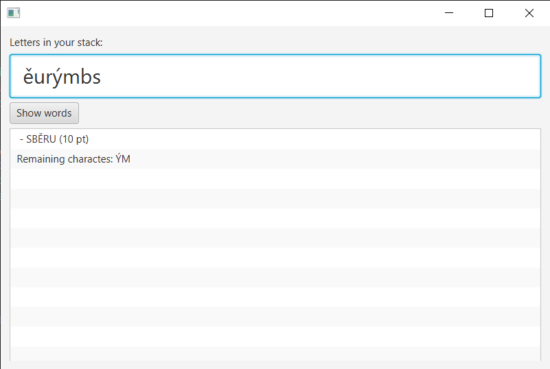

# Scrabble solver
Scrabble solver for the czech words (see [Wiki](https://en.wikipedia.org/wiki/Scrabble_letter_distributions#Czech))

Just an exercise in Java.
As a user starts to type letters the best possible words are shown in the list below:

